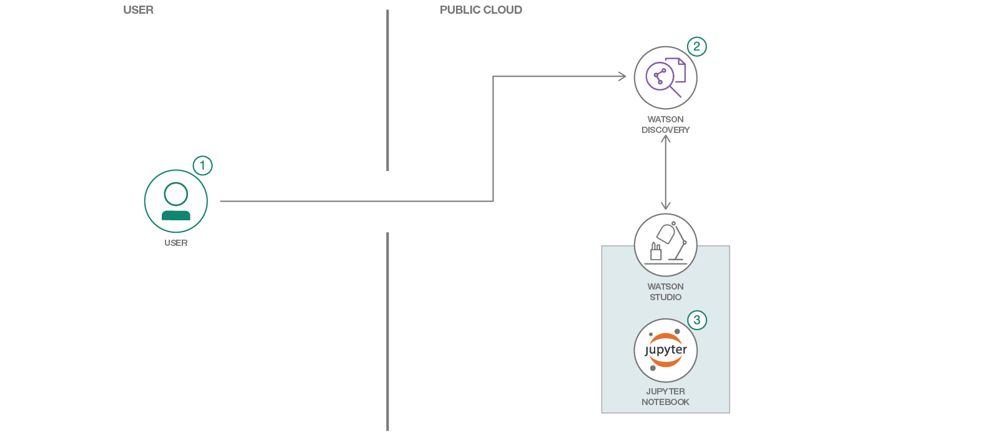

# Use Watson Discovery News to analyze cryptocurrency sentiment

In this example, we will use Watson Discovery News in order to query articles written about Bitcoin and visualize the sentiment of the articles. This should act as a baseline for integrating Watson Discovery into your own application. The use cases are endless, with Watson Discovery, and especially the "news" collection, you can harness the power of advanced queries in order to gain many insights.

# Flow
1. User creates an instance of Watson Discovery.
2. User run the provided Jupyter notebook with Watson Studio.
3. The Jupyter notebook leverages Watson Discovery News to visualize data sentiment and date.

# Included Components

* [Watson Studio](https://dataplatform.cloud.ibm.com/)
* [Watson Discovery](https://www.ibm.com/watson/services/discovery/)

# Featured Technologies

* [Jupyter Notebooks](http://jupyter.org/)
* [Matplotlib](https://matplotlib.org/)

# Steps

## Sign up for Watson Studio

Sign up for IBM's [Watson Studio](https://dataplatform.cloud.ibm.com). After signing in, create a new, **basic** project – give it a name, and create a new object storage service if prompted (the **lite** option will work fine).

## Allocate Discovery service

Head over to [IBM Cloud](http://bluemix.net/), if prompted, login with the same credentials as above. From the dashboard, click **Create Resource** and search for "*Discovery*" in the catalog. Click on the Discovery card, and click **Create**.

## Create Notebook

From Watson Studio, navigate to the project you created previously.
1. In the `Assets` tab, select the `Create notebook` option.
2. Select the `From URL` tab.
3. Enter a name for the notebook.
4. Optionally, enter a description for the notebook.
5. Enter this Notebook URL: https://raw.githubusercontent.com/IBM/crypto-discovery-news-sentiment-analysis/master/notebooks/crypto-analysis.ipynb

## Run the notebook

Once the notebook has been created, navigate to the cell with Watson Discovery credentials and enter your own. To find your credentials, navigate to your Discovery service, click on the menu item labeled *Credentials*, generate a new set if none exists yet. Now, you can run the notebook and analyze the results.

## Example output

See [examples/example_notebook.ipynb](examples/example_notebook.ipynb) for a full run of the notebook with output.

> Below is a snapshot of the type of analysis performed, showing both sentiment and date for cryptocurrencies.

# Learn more

* **Data Analytics Code Patterns**: Enjoyed this Code Pattern? Check out our other [Data Analytics Code Patterns](https://developer.ibm.com/code/technologies/data-science/)
* **With Watson**: Want to take your Watson app to the next level? Looking to utilize Watson Brand assets? [Join the With Watson program](https://www.ibm.com/watson/with-watson/) to leverage exclusive brand, marketing, and tech resources to amplify and accelerate your Watson embedded commercial solution.
* **Watson Studio**: Master the art of data science with IBM's [Watson Studio](https://dataplatform.ibm.com/)

# Links

* Check out the [blog post](https://medium.com/@SamuelCouch/visualizing-sentiment-in-the-news-89f40e8fcc21)!

# License

This code pattern is licensed under the Apache Software License, Version 2.  Separate third party code objects invoked within this code pattern are licensed by their respective providers pursuant to their own separate licenses. Contributions are subject to the Developer [Certificate of Origin, Version 1.1 (DCO)] (https://developercertificate.org/) and the [Apache Software License, Version 2] (http://www.apache.org/licenses/LICENSE-2.0.txt).

ASL FAQ link: http://www.apache.org/foundation/license-faq.html#WhatDoesItMEAN